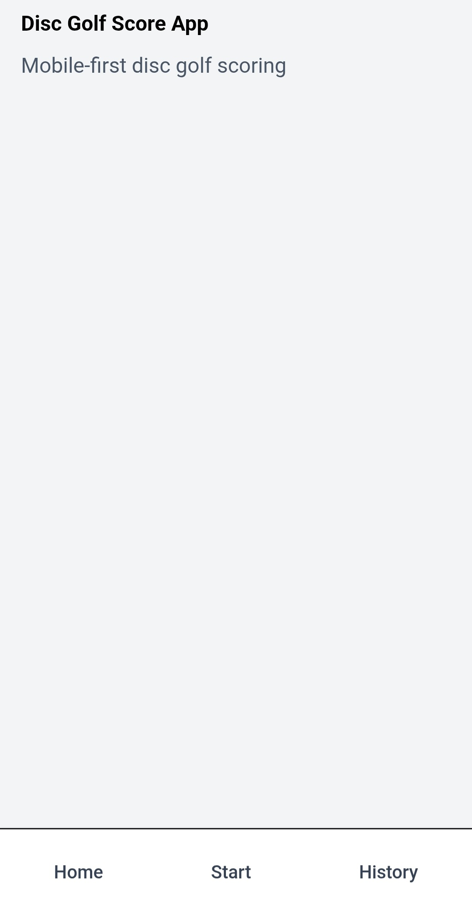

# Disc Golf Score App

A mobile-first web application for tracking disc golf rounds, scores, and round history. The app focuses on a simple and fast scoring experience optimized for use on a phone during a round.

## Overview
Disc Golf Score App allows players to track hole-by-hole scores, view live totals, and review completed rounds through a clear round history. The application is designed to be lightweight and usable without accounts or sign-up.

## Key Features
- Hole-by-hole score tracking for multiple players
- Real-time total score calculation
- Automatic winner detection at the end of a round
- Round history with per-round detail views
- Mobile-friendly layout with bottom navigation
- Local-first data storage using the browser

## Technical Highlights
- State-driven UI with per-player and per-hole score management
- Derived state for total scores and winner calculation
- Reusable React components for scorecards and round views
- Mobile-first layout designed for touch interaction
- Type-safe data models using TypeScript

## Screenshots

### Homepage


### Hole Scoring


### Overview


### Round History


### Round Details


## Tech Stack
- Next.js (App Router)
- TypeScript
- React
- Tailwind CSS / CSS Modules

## Development Setup

### Prerequisites
- Node.js 18+
- npm, pnpm, or yarn

## Install

Open a terminal in the project root and run:

```bash
npm install
```

## Development

Start the dev server:

```bash
npm run dev
```

Open http://localhost:3000 to view the app.

## Build

```bash
npm run build
npm run start
```

## Project Structure (high level)

- `src/app/` — Next.js app routes and pages
- `src/app/components/` — React components (layout, navigation, scorecard)
- `src/app/round/` — Round creation and scoring screens
- `src/app/history/` — Round history and detail pages

